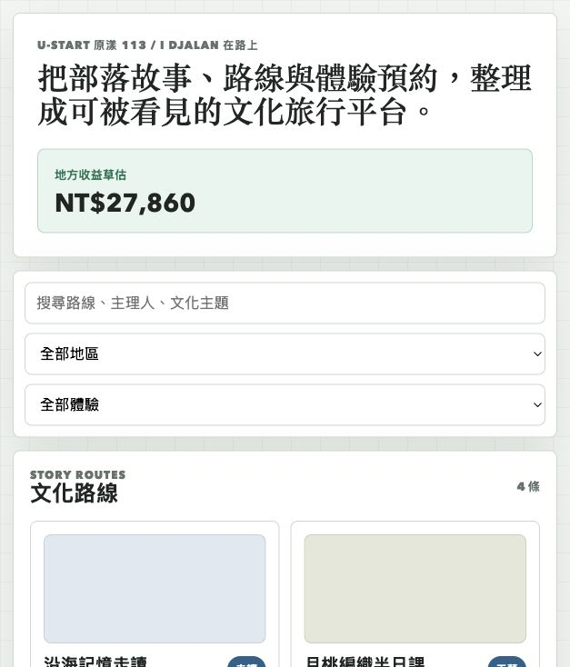
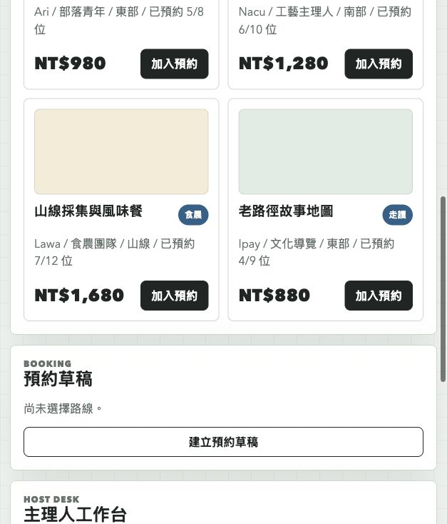

# I Djalan 在路上文化路線平台原型

## 快速看懂

- 線上 Demo：https://atlasforcn.github.io/startup-idjalan-cultural-routes/
- 這個原型在做什麼：把 I Djalan 在路上做成文化路線與體驗預約平台。
- 特色定位：特色是把原民/地方文化旅程轉成路線節點、故事內容與預約管理。
- 操作流程：探索文化路線與體驗場域 → 查看故事節點、導覽內容與可預約時段 → 建立行程並追蹤參與者回饋

展開完整功能流程截圖

## 比賽來源

- 競賽：U-start 原漾計畫
- 屆次：113 年度第二階段績優團隊
- 得獎作品：I Djalan 在路上
- 學校：中國文化大學
- 公司：在路上無限文化有限公司
- 類別：原住民族青年創業
- 官方來源：https://ustart.yda.gov.tw/p/405-1000-2079,c147.php?Lang=zh-tw

## 核心概念

依公開名稱「I Djalan 在路上」理解，本原型把作品概念實作為原民文化路線與體驗預約平台。核心是讓部落故事、地方主理人、走讀路線、工藝食農體驗、預約與地方收益可以被整理、搜尋與營運。

## 功能

- 搜尋文化路線、主理人與文化主題
- 依地區與體驗類型篩選
- 查看路線剩餘名額、價格與主理人
- 加入預約清單並建立預約草稿
- 主理人新增路線
- 追蹤地方收益草估

## 聲明

本 repo 是依官方公開得獎名稱建立的概念原型，不代表原團隊授權產品，也未使用原團隊商標、素材或未公開資料。
